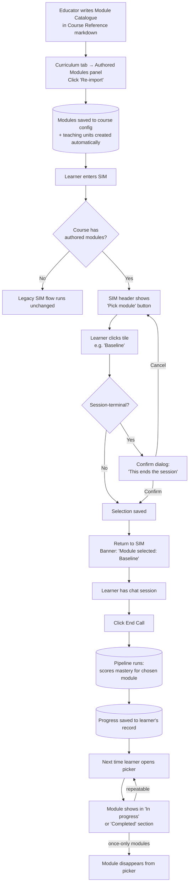

# Module Picker — what we shipped on 6 May 2026

A learner-facing module picker is now live in the simulator. This doc explains what changed, who it's for, and how to use it. **No code knowledge required.**

---

## In one sentence

**Educators write a list of modules in their Course Reference document; learners now see those modules as a menu and pick what to practise next; the system records which modules they've finished so the menu adapts as they progress.**

---

## Who benefits, and how

| You are… | What's new for you |
|---|---|
| **A course author** (educator) | You write a "Module Catalogue" table in your Course Reference markdown, click "Re-import" once, and learners can now choose between your modules — no further wiring. |
| **A learner** (or simulator tester) | Before each session, you see a **Pick module** menu. You click whichever module you want to practise. After the session, the picker remembers what you finished and adapts. |
| **A product/QA tester** | You can run an entire learner journey end-to-end inside the SIM: open a course, pick a module, have a chat session, end the call, return — and watch the module move from "Up next" → "In progress" → "Completed". |

---

## The big picture (lifecycle)



---

## What changed today — five PRs, all merged

| PR | Plain-English summary |
|---|---|
| **#243** | Built the picker page itself. Added a **Pick module** button to the SIM header that opens it. |
| **#247** | Made the picker show progress: tiles group into "Up next / In progress / Completed"; rail rows get an "In progress" pill alongside the existing "Done" tick. |
| **#248** | Added a banner in the SIM that confirms which module the learner picked. (Was a placeholder; #250 made it real.) |
| **#249** | Closed a hidden gap: when an educator imports modules, the system now also creates the underlying teaching-unit records that the rest of the platform needs to track progress. |
| **#250** | Real wiring end-to-end: the learner's pick now influences which module gets assessed at session end, so progress actually populates the picker the next time around. |

---

## Educator side — how to use it

### One-time setup per course

1. **Open your Course Reference markdown document** (the file you've been writing in your `Downloads/` folder is fine).
2. Add a section like this:

   > ## Modules
   >
   > **Modules authored:** Yes
   >
   > ### Module Catalogue
   >
   > | ID | Label | Mode | Duration | Scoring fired | Voice band readout | Session-terminal | Frequency |
   > |---|---|---|---|---|---|---|---|
   > | `baseline` | Baseline Assessment | examiner | 20 min fixed | All four | No | Yes | once |
   > | `part1` | Part 1: Familiar Topics | tutor | Student-led | LR + GRA | No | No | repeatable |
   > | `part2` | Part 2: Cue Card Monologues | mixed | Student-led | All four | No | No | repeatable |

3. **In the admin app, navigate to:** Courses → *your course* → **Curriculum** tab → **Authored Modules** panel.
4. Click **Re-import**, paste the markdown, hit **Import**. (Or upload the file.)
5. You'll see the parsed catalogue + a live preview of how learners will see it.

### What you can verify

| You'll see… | Where |
|---|---|
| Module catalogue table | Curriculum tab → Authored Modules panel |
| "From Course Reference" status pill | Top of the panel |
| Validation warnings (if you typed something wrong) | Below the table |
| Live learner preview | Bottom of the panel |

### What "Frequency" means

| Value | Meaning | Behaviour in the picker |
|---|---|---|
| `once` | Take it once, then never again | Disappears from the picker after completion |
| `repeatable` | Practise as many times as you like | Stays visible even after completion (in the "Completed" section for tiles) |
| `cooldown` | Wait between attempts | Same as repeatable for now |

### What "Session-terminal" means

A module that **ends the session** when started — typically a baseline assessment or a mock exam. The learner sees a confirmation dialog before launching one of these.

---

## Learner side — how to use it

### Step 1: Open the simulator

Navigate to **/x/sim** → click into a caller conversation. The SIM works just like before for legacy courses.

### Step 2: See the Pick module button

If your course has authored modules, the WhatsApp-style header shows a **layers icon** (the "Pick module" button) next to the existing buttons.

```
┌────────────────────────────────────────────────────┐
│  ←  [Avatar]  Caller name              📁 🎤 📊 ⚡ │
│                                                  ↑  │
│                       NEW: Pick module button       │
└────────────────────────────────────────────────────┘
```

If you don't see the button, the course's educator hasn't imported modules yet — and the SIM falls back to the legacy flow.

### Step 3: Pick

Click the button. You land on a page showing the modules organised either as:

- **Tiles** (for "continuous" courses like IELTS — order doesn't matter), grouped into:
  - **Up next** — modules you haven't started
  - **In progress** — modules you've partially completed
  - **Completed** — modules you've finished (only for repeatable ones; once-only modules disappear here)
- **Rail** (for "structured" courses where order matters), with:
  - A position number on each row
  - Badges showing "In progress" and "Done" where applicable
  - A "Recommended after X" hint if you haven't met the prerequisites yet

### Step 4: Confirm session-terminal modules

If you pick a module marked "Ends session" (Baseline, Mock), a dialog warns you:

> **This module ends the session**
> Baseline Assessment (20 min fixed) is a single-segment session — once you start it, the tutor will not move on to other modules in the same call.
> [Cancel]   [Start anyway]

### Step 5: Go back to the SIM and start your session

The SIM now shows a banner at the top:

> **Module selected:** Next session will focus on `baseline`. Mastery will be tracked against this module after the call.

Click the phone icon in the SIM header to start the session — the AI tutor will assess you on that module.

### Step 6: End the call, see your progress

When you click **End Call**, the system runs an analysis in the background. After a moment, return to the picker and you'll see your module has moved into "In progress" (partial mastery) or "Completed" (full mastery).

For `frequency: once` modules like Baseline, the tile **disappears** from the picker after completion — you can't accidentally retake them.

---

## Where to look in the UI — admin map

| Want to see… | Go to |
|---|---|
| Authored module list for a course | Courses → *course* → Curriculum tab → Authored Modules panel |
| The picker as a learner sees it | Curriculum tab → Authored Modules → preview at the bottom (read-only) |
| The real picker, live | SIM header → Pick module button (icon: layers) |
| Per-learner module progress | (DB-only at present — no admin view yet) |

---

## How to verify a full learner round-trip on the VM

After running `/vm-cpp` (which applies the new database column), do this:

1. **Re-import the IELTS Course Reference** (or any course with a Module Catalogue) — confirms the educator side
2. **Open the SIM** as a learner enrolled in that course
3. **Click "Pick module"** in the header — confirms the button appears
4. **Pick `baseline`** — see the confirm dialog (it's session-terminal)
5. **Click "Start anyway"** — back in the SIM, banner reads "Module selected: baseline"
6. **Click the phone icon** to start the session, exchange a few messages, **End Call**
7. **Wait 10–30 seconds** for the pipeline to finish
8. **Return to the picker** — `baseline` should be hidden (frequency: once + completed) OR appear in "Completed" if you set `frequency: repeatable`

If steps 1–5 work but step 8 doesn't show progress, the pipeline either didn't run or didn't emit mastery for that module — check the call's pipeline log via the admin tools.

---

## What we deliberately did NOT build today

| Not built | Why | When it'll happen |
|---|---|---|
| Real-learner auto-routing to picker | We deferred this until the SIM-only flow proved itself end-to-end | **Next** (Slice 4 in progress) |
| Phone (VAPI) callers see the module hint | Deferred per your instruction — SIM-only today | Future ticket |
| Tutor system prompt explicitly accepting a module override beyond what `loadCurrentModuleContext` already provides | Doesn't appear necessary yet — the existing assessment context already steers the tutor toward the chosen module's outcomes | Re-evaluate after a few real test sessions |
| End-of-course celebration | Course completion already shows on the SIM landing page; we didn't add a new screen here | Future polish |
| Recommended-next as a real algorithm | Currently a simple "after prereqs" rule | Polish item |

---

## Glossary

| Term | Meaning |
|---|---|
| **Course Reference** | The markdown document an educator writes to define a course's content. Lives off-repo today (a Downloads file). |
| **Module Catalogue** | A table inside the Course Reference that lists the named modules a learner can pick. |
| **Authored module** | A module declared by an educator in the Module Catalogue, as opposed to one derived automatically by the system. |
| **Curriculum module** | The internal teaching-unit record the platform tracks progress against. (Today, every authored module gets a matching curriculum module behind the scenes — we wired this in PR #249.) |
| **`frequency: once`** | Take this module once and never see it again. (Baseline, Mock) |
| **Session-terminal** | A module that finishes the session when started. The picker shows a confirm dialog before launching one. |
| **Mastery** | A 0-to-1 score the AI assigns after assessing the learner. ≥ 1.0 = "Completed", > 0 = "In progress", 0 = "Not started". |
| **`requestedModuleId`** | The technical name for the learner's pick — lives in the URL, then on the call record, then drives the assessment. (Most non-engineers can ignore this term.) |

---

## What today proved

The end-to-end loop works for the simulator path:

```
educator writes  →  learner picks  →  AI assesses  →  picker adapts
```

That's the whole experience. With Slice 4 next, real learners (not just SIM testers) will be auto-routed into this loop.
